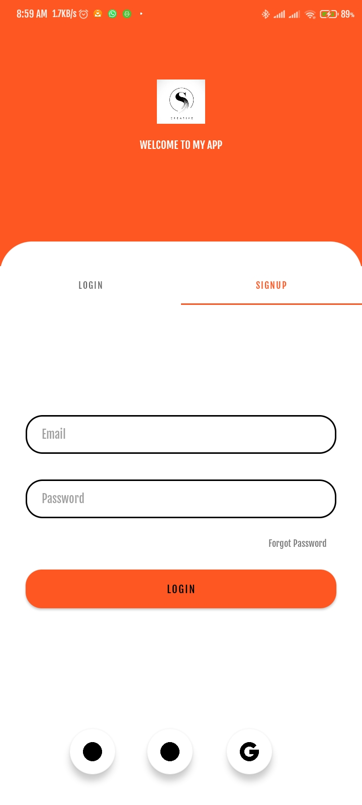
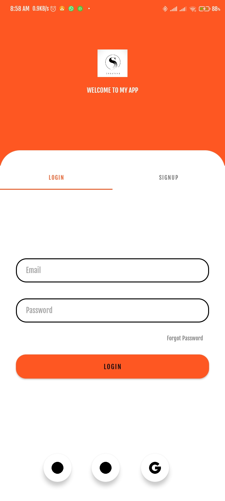

# Android App Template

### Splash Screen

  

### Login Screen

  

### Registration Screen

  

## Demo

 <a href="https://www.youtube.com/shorts/SJCEROXamjo" target="_blank">
    
     
    <strong>Click to watch demo on YouTube</strong>
  </a>

## Resources and Libraries Used

### Resource Libraries:
- **Lottie**: [Lottie by Airbnb](https://lottiefiles.com/)
  - `implementation 'com.airbnb.android:lottie:5.2.0'`
